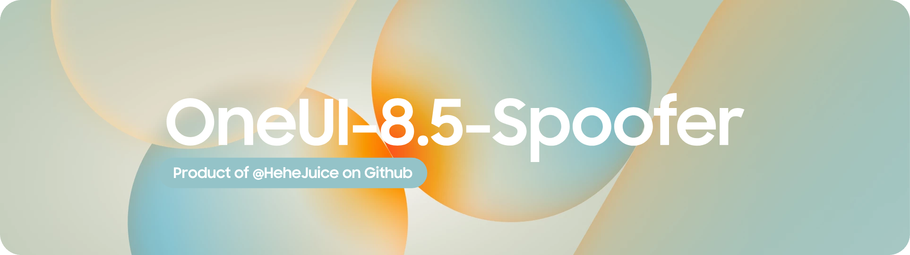

<h1 align="center">
  
</h1>

### 🗺 Project Overview 
- OneUI 9 Spoofer is a LSPosed Module that Apply OneUI 9 Spoof For OneUI 7 ~ 8.5
     - Spoof System.prop
     - Spoof OneUI Permission XML
- LSPosed and Root Required

### 🤔 Why this patch is made?
- It's aim is to prevent the following problems because of "Full-System-UI-9-Spoofing" 
     - Samsung Camera Crash
     - HomeUP Refused to Launch 
     - Other
- Why this patch won't have these problems?
     - It only applies UI 9 Spoof to Selected Apps 
     
### 📝 Other Features 
- Unlock OneUI 9 App Layout 
     - Required OneUI 9 App Installed
     - These Following apps have new UI Layout
          - Gallery
          - Probably more
- Unlock OneUI 9 Blur UI 
     - Required OneUI 9 App Installed
     - Required the device itself supports Live-Blur
     - Tested Blur UI in the following apps
          - Gallery
          - Device Care
          - Digital Wellbeing 
          - Mode and Routine 
          - ETC

### ℹ️ How to use?
- Install the .APK and activate in LSPosed

### 🥰 Credits
- HeheJuice aka ME ,for making the whole spoof 
- LSPosed Team for the patch method
